# Lab 1: Basic Network Setup

## Objective

To configure static and dynamic routing between two networks.

## Topology

In this case, I used three 1841 routers, which I named R1, R2, and R3. I also used two PCs, which I designated P1 and P2, respectively.


## Device Configuration Table

| **Device** | **Interface** | **IP Address** | **Subnet Mask** | Connected To | Network |
| ---------- | ------------- | -------------- | --------------- | ------------ | ------- |
| P1         | FastEthernet0 | 10.0.0.2       | 255.0.0.0       | R1 f0/0      | A       |
| R1         | f0/0          | 10.0.0.1       | 255.0.0.0       | P1           | A       |
| R1         | f0/1          | 20.0.0.1       | 255.0.0.0       | R2 f0/0      | B       |
| R2         | f0/0          | 20.0.0.2       | 255.0.0.0       | R1 f0/1      | B       |
| R2         | f0/1          | 30.0.0.1       | 255.0.0.0       | R3 f0/0      | C       |
| R3         | f0/0          | 30.0.0.2       | 255.0.0.0       | R2 f0/1      | C       |
| R3         | f0/1          | 40.0.0.1       | 255.0.0.0       | P2           | D       |
| P2         | FastEthernet0 | 40.0.0.2       | 255.0.0.0       | R3 f0/1      | D       |

### Step 1: Cable connection

Use copper cross cables to link all of the PCs and routers.

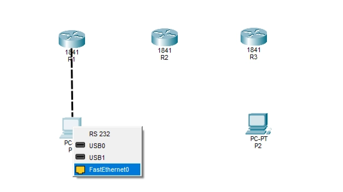

I've connected all of the PCs and routers. However, we are unable to send data from P1 to P2 because they are not yet configured.

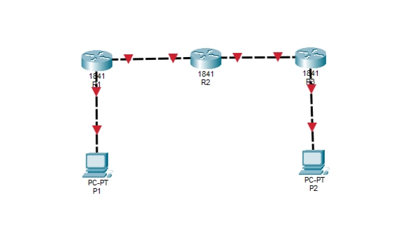

### Step 2: PC IP Configuration

Click P1, then go to Desktop > IP Configuration, and enter the IPv4 address, Subnet Mask, and Default Gateway as shown in the picture.

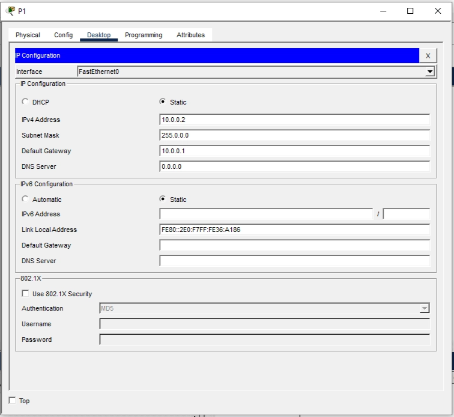

Next, click P2, then go to Desktop > IP Configuration, and enter the IPv4 address, Subnet Mask, and Default Gateway as shown in the picture.

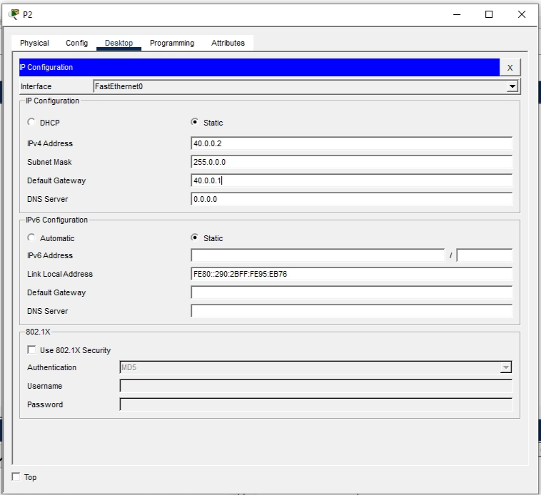

### Step 3: Start the routers

When you click R1 and navigate to CLI, the following appears. To enter the user mode, just type ‘no’ and hit ENTER.


## Key Commands and Configurations

User Mode (Router>)

```bash
enable
```

Priviledge Mode (Router#)

```bash
configure terminal | config terminal | conf t
```

(OPTIONAL): We can change Router(config)# to R1(config)# and add a password using the following commands:

```bash
hostname R1
enable password pass1example
```

To enter the interface use

```bash
interface f0/0 | int f0/1
```

After entering IP address, use

```bash
no shutdown
```

And use the following command to exit the interface

```bash
exit
```

Save the config file in NVRAM by using the command after providing the IP addresses.

You can only use this command after exiting the Priviledge mode using the above “exit” command.

```bash
copy run start
```

## Router IP Configuration

R1(config-if)#:

```bash
ip address 10.0.0.1 255.0.0.0
ip address 20.0.0.1 255.0.0.0
```

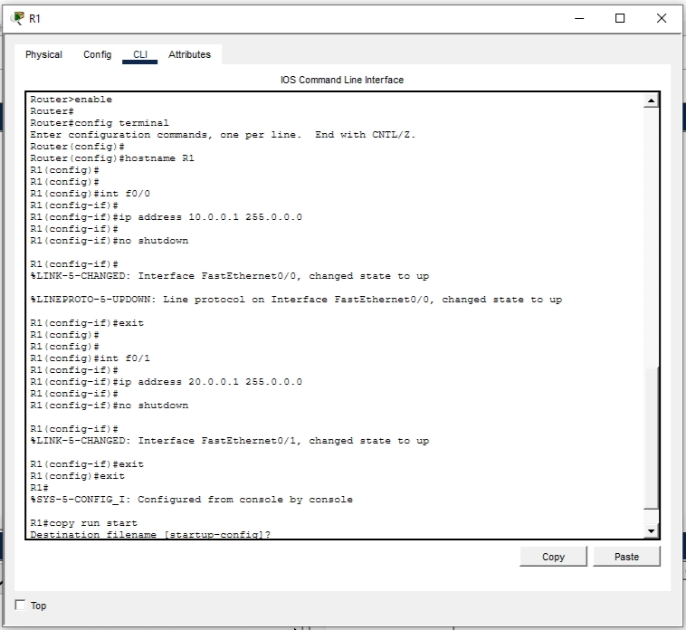

R2(config-if)#:

```bash
ip address 20.0.0.2 255.0.0.0
ip address 30.0.0.1 255.0.0.0
```

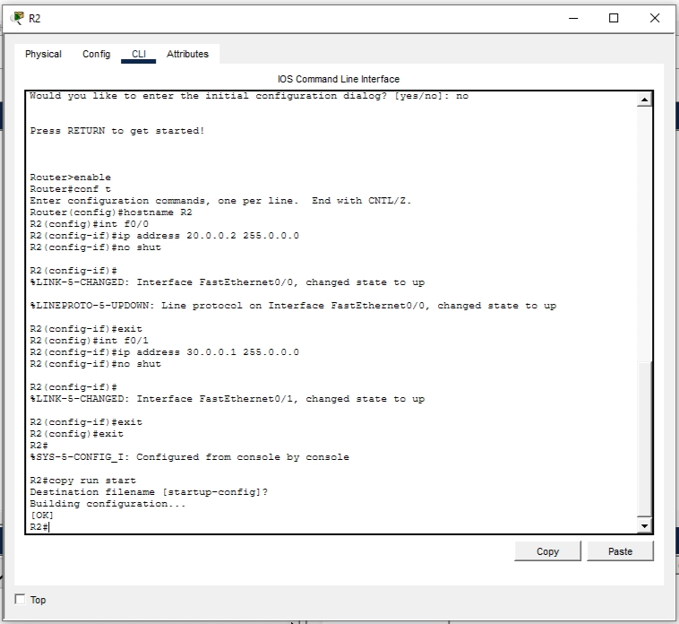

R3(config-if)#:

```bash
ip address 30.0.0.2 255.0.0.0
ip address 40.0.0.1 255.0.0.0
```

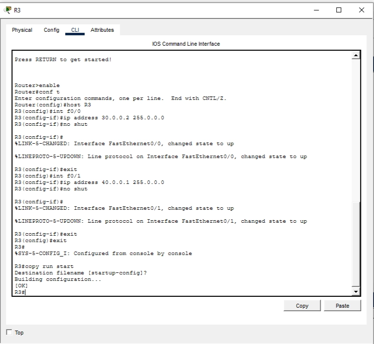

Then, since the connection is now green, you can see that every device has joined properly.

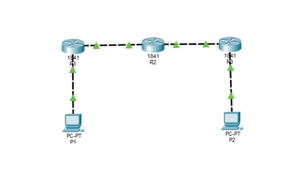

Let's attempt to ping P2 from P1. Just click on P1 and navigate to Command Prompt.

```bash
ping 40.0.0.2
```

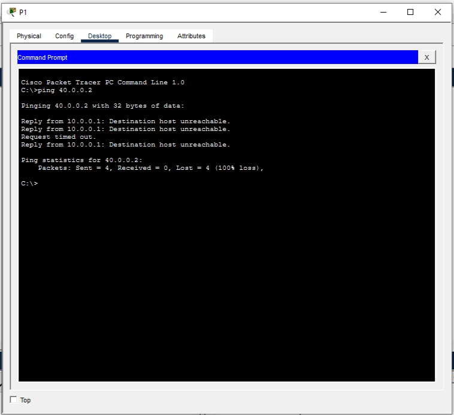

Because P1 lacks a gateway to reach P2, it will respond with "Request timed out.”

## Static Routing

Let's see the IP addresses in R1 by using the command

```bash
show ip route
```

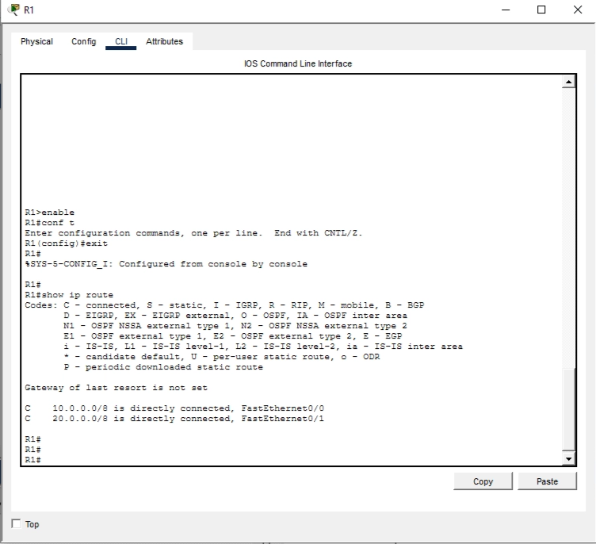

We will assign IP addresses to each router individually in order to add the gateways to every router. To accomplish that, follow the instructions in the image.

R1(config-if)#:

```bash
ip route 30.0.0.0 255.0.0.0 20.0.0.2
ip route 40.0.0.0 255.0.0.0 20.0.0.2
```

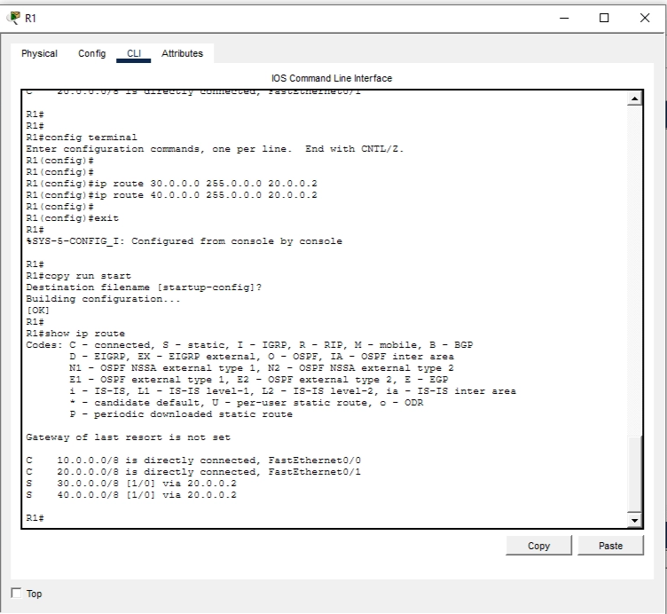

R2(config-if)#::

```bash
ip route 10.0.0.0 255.0.0.0 20.0.0.1
ip route 40.0.0.0 255.0.0.0 30.0.0.2
```


R3(config-if)#:

```bash
ip route 10.0.0.0 255.0.0.0 30.0.0.1
ip route 20.0.0.0 255.0.0.0 30.0.0.1
```

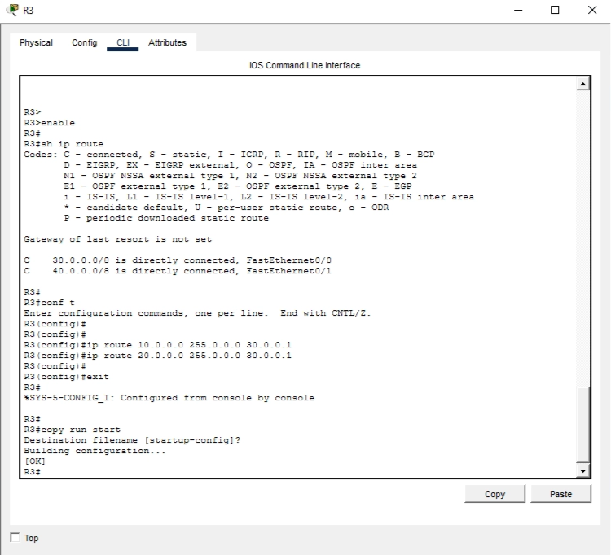

Now let's try to ping P1 from P2 using the command

```bash
ping 10.0.0.2
```

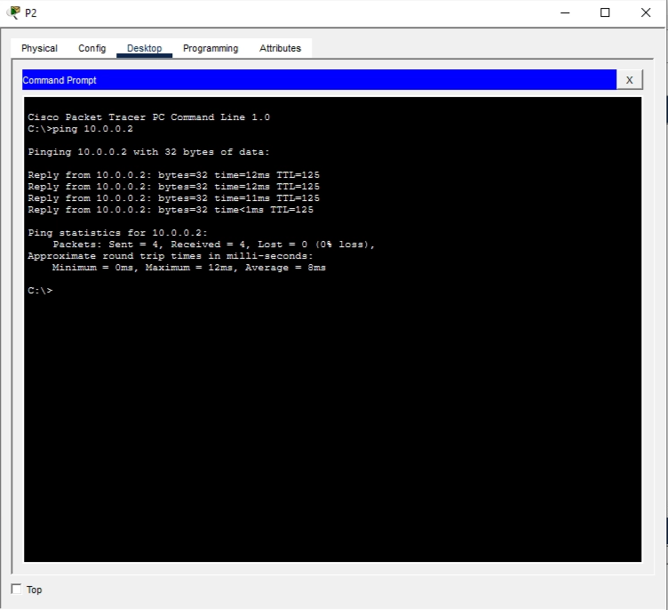

We've successfully set up a static connection between the routers and the PCs.

## Dynamic Routing

This is limited to the topology's edge routers, which in this instance are R1 and R3.

R1(config-if)#:

```bash
no ip route 30.0.0.0 255.0.0.0 20.0.0.2
no ip route 40.0.0.0 255.0.0.0 20.0.0.2

#add default static route
ip route 0.0.0.0 0.0.0.0 20.0.0.2
```

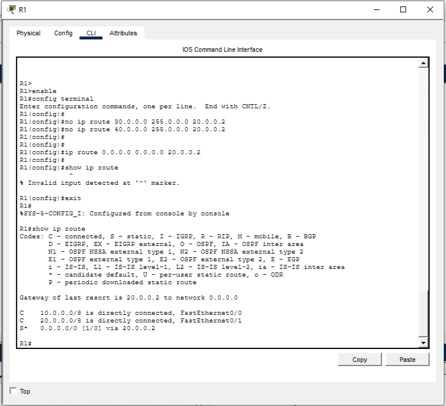

R3(config-if)#:

```bash
no ip route 10.0.0.0 255.0.0.0 30.0.0.1
no ip route 20.0.0.0 255.0.0.0 30.0.0.1

#add default static route
ip route 0.0.0.0 0.0.0.0 30.0.0.1
```


